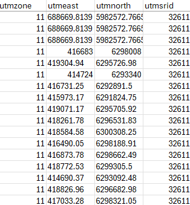
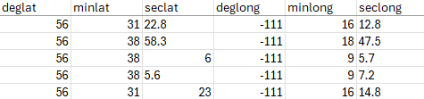
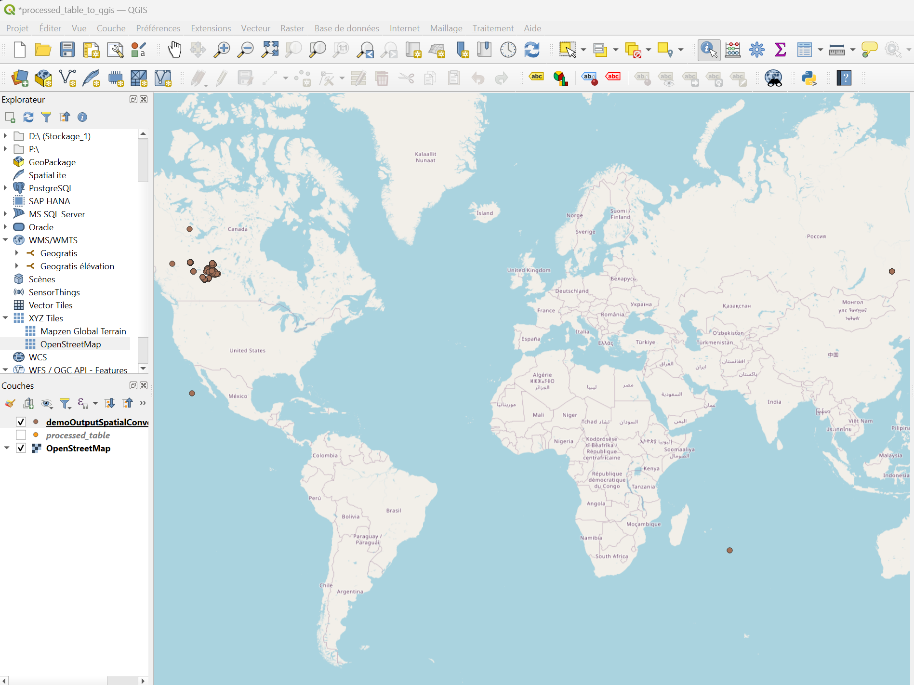

# How to Convert Spreadsheet Spatial Data to Geographic Coordinates (Decimal Degrees) with Python

This guide explains how to convert and standardize spatial data in an Excel spreadsheet to decimal degrees (DD).

>[!NOTE]
>Ensure you have Python with Pandas & Pyproj librairies installed on your computer.

## 1. Install Python and proper librairies 

### Install python: 

At the command line, verify Python is installed: 
```
python --version
```

If not intsalled, you can download/install it from here: https://www.python.org/downloads/


### Install pip: 

At the command line, verify pip is installed:
```
pip --version
```

If not installed, you can install pip by running:
```
python -m ensurepip --upgrade
```

### Install pandas and pyproj

```
pip install pandas pyproj 
```

After installation, confirm that both packages are installed by running:
```
python -m pip show pandas
python -m pip show pyproj
```

## 2. Configure Spreadsheet

### Base Configuration

- **IMPORTANT:** Use periodes (.) and not commas (,) for decimal values for all numeric coordinate data in your spreadsheet.

- Python will create 2 new columns named "lat_decimal" and "long_decimal" to store all calculed DD values.

- **IMPORTANT:** The 3 following coordinate conversion calculations will be ignored if they do not contain the proper column names. In addition, please note that these steps are executed in order. The first step to add spatial conversion data to the lat_decimal and long_decimal fields, will block the followoing step from overwritting theses values.  

### i - For DD Coordinates

- If you already have some spatial coordinates in DD, you may preserve this information in columns named "decimlat" and "decimlong". Theses columns will be kept intact during the coordinates calculations in the follooing steps. This will enable you compare theses values with the new DD calculations. Their values will be copied in the neuwly created lat_decimal and long_decimal Python columns.


### ii -For UTM Coordinates

- If you have no UTM corrdinates to convert you may ignore this step. If Python does not find the required UTM columns ("utmeast", "utmnorth" and "utmzone"), this conversion step will be skipped. These columns must containing the spatial data you wish to covert.

- Identify the appropriate EPSG code for your UTM zone (e.g., WGS 84 / UTM zone 11N = EPSG:32611). Refer to EPSG.io for codes. Create a column named "utmsrid" and populate it with the corresponding SRID for each row. Example EPSG codes:

  - WGS 84 / UTM zone 11N: EPSG:32611 → 32611

  - WGS 84 / UTM zone 12N: EPSG:32612 → 32612




### iii - For Degree/Minute/Second (DMS) Coordinates

- If you have no DMS values to convert you may ignore ths step. If Python does not find the required DMS columns (deglat, minlat, seclat, deglong, minlong, seclong), this conversion step will be skipped.

- Ensure the spreadsheet contains these six columns. These columns must contain your coordinate data in DMS that you wish to convert to DD.




### Final Spreadsheet Formating/Validation

- Take a look at this file for a demo of a correctly configured spreadsheet in CSV format: demoInputSpatialConversionData.csv

- All other data columns found in this spreadsheet will simply be ignored in data conversion and copied as is into the final spreadsheet output.

### Save Spreadsheet to CSV Format

- Save the Excel spreadsheet as a CSV file (*.csv). This format is required for database import. IMPORTANT: Use the";" as the column delimiter.

- Name the CSV file "input_spatial_data.csv" and place it in the same folder as the "spatial_converter.py" Python file.


## 3. Convert Spreadsheet with Python

- Open the Windows command line (CMD) to the folder containing the "spatial_converter.py" Python file. 

- At the command line, run the Python script on your CSV file. The python code will look for a spreadsheet in the same folder named "input_spatial_data.csv".

```
python spatial_converter.py

```

If run successfully, the Python code will create folder named "output_converted_spatial_data.csv" containing your converted spatial data. Your new converted DD data will be located in the columns named "lat_decimal" and "lon_decimal".


## 4. Validate DD Coordinates

You can open your exported CVS file and view it in a QGIS map to visualy validate the new spatial coordinates on a map. The lat_decima/lon_decimal columns contain your new spatial coordinates in the CSV file.

**Usefull info for QGIS:**
- How to connect PostGIS to QGIS: A Step-by-Step Guide (Tutorial) - See step 4 - https://medium.com/@faithabiala/how-to-connect-postgis-to-qgis-a-step-by-step-guide-tutorial-72375c7cc71d
- Add an OpenStreetMap layer to QGIS - https://www.youtube.com/watch?v=XHQawq_tP98
- Use projection epsg:3857 for a better display of OpenStreetMap in QGIS.




