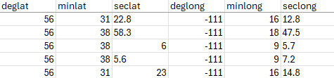

# How to Convert Spreadsheet Spatial Data to Geographic Coordinates (Decimal Degrees) with PostgreSQL/PostGIS

This guide explains how to convert and standardize spatial data in an Excel spreadsheet to decimal degrees (DD).

>[!NOTE]
>Ensure you have PostgreSQL installed on your computer with Postgis extension. If not, the easiest way to set it up is by using a Docker image of PostgreSQL/PostGIS. Refer to this page for instructions: https://github.com/heryk/postgresqlDev_Docker. Additionally, install PGAdmin for managing your PostgreSQL/PostGIS database: https://www.pgadmin.org/download/

## 1. Configure Spreadsheet

### Base Configuration

- **IMPORTANT:** Use periodes (.) and not commas (,) for decimal values for all numeric coordinate data.

- For spatial conversions, you need a special minimalist spreadsheet containing only spatial data and an "id" column. The "id" column will enable you to rematch your spatial data coversion to your original spreedsheet data. Here is an example:


- If you already have some spatial coordinates in DD, you may preserve this information in columns named "decimlat" and "decimlong". Theses columns will be kept intact during the coordinates calculations in the follooing steps. This will enable you compare theses values with the new DD calculations.

### For UTM Coordinates

- Create a columns containing UTM coordinates named "utmeast", "utmnorth" and "utmzone". These columns containing the spatial data you wish to covert.

- Identify the appropriate EPSG code for your UTM zone (e.g., WGS 84 / UTM zone 11N = EPSG:32611). Refer to EPSG.io for codes. Create a column named utmsrid and populate it with the corresponding SRID for each row. Example EPSG codes:

  - WGS 84 / UTM zone 11N: EPSG:32611 → 32611

  - WGS 84 / UTM zone 12N: EPSG:32612 → 32612


### For Degree/Minute/Second (DMS) Coordinates

- Ensure the spreadsheet contains six columns named: deglat, minlat, seclat, deglong, minlong, seclong. These columns must contain your coordinate data in DMS that you wish to convert to DD.




### Final Spreadsheet Formating/Validation

- Take a look at this file for a demo of a correctly configured spreadsheet in CSV format: demoInputSpatialConversionData.csv

### Save Spreadsheet to CSV Format

- Save the Excel spreadsheet as a CSV file (*.csv). This format is required for database import. IMPORTANT: Use the";" as the column delimiter.


## 2. Import Spreadsheet into PostgreSQL/PostGIS Database (DB)

- Open PGAdmin and connect to your PostgreSQL/PostGIS instance.

- Create a new database using the PostGIS schema template if one doesn’t exist.

- In the public schema, create an empty table named original_table using the following SQL:

```
CREATE TABLE IF NOT EXISTS public.original_table
(
    id TEXT,
    deglat INTEGER,
    minlat INTEGER,
    seclat DOUBLE PRECISION,
    deglong INTEGER,
    minlong INTEGER,
    seclong DOUBLE PRECISION,
    utmzone INTEGER,
    utmeast DOUBLE PRECISION,
    utmnorth DOUBLE PRECISION,
    utmsrid INTEGER,
    decimlat DOUBLE PRECISION,
    decimlong DOUBLE PRECISION
);
ALTER TABLE IF EXISTS public.original_table
    OWNER TO postgres;
```

- Use the Import Data option to load your CSV file in to this newly created table. Use the following configuration in the import tool: 
    - Specify ";" as the CSV column delimiter
    - Specify UTF8 for csv encoding
    - Select with csv "Header"
    - Leave "quote" and "escape" values empty

- Run the following SQL to create a new table processed_table, which will include the original data along with new columns for decimal degrees and spatial geometry. This will enable you to keep the original_table data intact. This new processed_table will contain all your original_table data plus 3 new columns (geom, lat_decimal and lon_decimal) containing for your new calculed decimal degree coordinates. Please note that the "geom" column is a special postgis geometry field used to store spatial information. To execute the following SQL, right click on the public schema and select "Query Tool". Paste the SQL in the query tool and execute query.

```
CREATE TABLE processed_table AS
SELECT *, NULL::geometry AS geom, NULL::double precision AS lat_decimal, NULL::double precision AS lon_decimal
FROM original_table;
```

## 3. Standardize DB Spatial Data to DD

>[!IMPORTANT]
> The order in which the following spatial conversions (e.g., UTM, DMS, etc.) are executed is crucial. Once spatial data has been converted into the `geom`, `lat_decimal`, and `lon_decimal` columns, this data is protected and will not be overwritten by subsequent conversions. As a result, any records with non-`NULL` values in these columns will be ignored during further spatial conversion steps. To save time, execute only the following steps that apply to your data.


### If you already have some data in DD coordinates...

If you already have records with coordinates in decimal degrees (DD) in `decimlat` and `decimlong` columns, you will convert them into PostGIS geometries (`geom`) using the script below:

```
UPDATE processed_table
SET geom = CASE
    WHEN decimlat IS NOT NULL AND decimlong IS NOT NULL AND geom IS NULL
    THEN ST_SetSRID(ST_Point(decimlong, decimlat), 4326)
    ELSE geom
END;
```

Now copy your original DD data from the `decimlat` and `decimlong` columns to the new DD columns (`lat_decimal` and `lon_decimal`) with this SQL script:

```
UPDATE processed_table
SET 
    lat_decimal = decimlat,
    lon_decimal = decimlong
WHERE 
    lat_decimal IS NULL 
    AND lon_decimal IS NULL 
    AND decimlat IS NOT NULL
    AND decimlong IS NOT NULL;
```

Optional: To visually inspect the first 100 records with decimlat data, you can execute the following SQL. From there you can click on the map buton to see your data ("geom" field) on a map.

```
SELECT * FROM public.processed_table WHERE decimlat IS NOT NULL LIMIT 100
```

### If you have some data in UTM coordinates...

Run the following SQL to convert UTM coordinates into PostGIS geometries:

```
UPDATE processed_table
SET geom = ST_Transform(
  ST_SetSRID(
    ST_MakePoint(
      "utmeast"::DOUBLE PRECISION,
      "utmnorth"::DOUBLE PRECISION
    ),
    "utmsrid"::INTEGER
  ), 4326
)
WHERE "utmeast" IS NOT NULL 
  AND "utmnorth" IS NOT NULL 
  AND "utmsrid" IS NOT NULL
  AND "geom" IS NULL;
```

Populate latitude and longitude columns with the new PostGIS geometries:

```
UPDATE processed_table 
SET lat_decimal = COALESCE(lat_decimal, ST_Y(geom)),
    lon_decimal = COALESCE(lon_decimal, ST_X(geom))
WHERE "utmeast" IS NOT NULL 
  AND "utmnorth" IS NOT NULL 
  AND "utmsrid" IS NOT NULL
  AND "geom" IS NOT NULL;
```

Optional: To visually inspect first 100 records with UTM data, you can execute the following SQL. From there you can click on the map buton to see your data ("geom" field) on a map.

```
SELECT * FROM public.processed_table WHERE utmsrid IS NOT NULL LIMIT 100
```

### If you have some data in DMS coordinates...

Execute this script to convert DMS data to DD:

```
UPDATE processed_table
SET lat_decimal = CASE
    WHEN "deglat" IS NOT NULL AND "minlat" IS NOT NULL AND "seclat" IS NOT NULL AND lat_decimal IS NULL
    THEN "deglat"::numeric + ("minlat"::numeric / 60) + ("seclat"::numeric / 3600)
    ELSE lat_decimal
  END,
    lon_decimal = CASE
    WHEN "deglong" IS NOT NULL AND "minlong" IS NOT NULL AND "seclong" IS NOT NULL AND lon_decimal IS NULL
    THEN "deglong"::numeric + ("minlong"::numeric / 60) + ("seclong"::numeric / 3600)
    ELSE lon_decimal
  END;
```

Execute this script to convert DD data PostGIS geometries:

```
UPDATE processed_table
SET geom = CASE
    WHEN lat_decimal IS NOT NULL AND lon_decimal IS NOT NULL AND geom IS NULL AND deglat IS NOT NULL AND minlat IS NOT NULL AND seclat IS NOT NULL AND deglong IS NOT NULL AND minlong IS NOT NULL AND seclong IS NOT NULL
    THEN ST_SetSRID(ST_Point(lon_decimal, lat_decimal), 4326)
    ELSE geom
END;
```

Optional: To visually inspect the first records with lat_decimal data, you can execute the following SQL. From there you can click on the map buton to see your data ("geom" field) on a map.

```
SELECT * FROM public.processed_table WHERE deglat IS NOT NULL LIMIT 100;
```


## 4. Export DB Spatial Data to CSV

- Before exporting your data, you can view the geom column in a PGAdmin map. 


- Use PGAdmin or a tool like DBeaver to export processed_table as a CSV file. Use ; as the delimiter for better compatibility. To export data, right click on the "procesed_table" and select "Export Data".

## 5. Validate DD Coordinates

It is important to check spatial conversion results to ensure all spatial data has been successfully standardized. You can connect to the DB table using QGIS to view the data on a map. The geom field can be used to visually validate the coordinates on a map.

Instead of connectiong QGIS to your DB, you can also open your exported CVS file and view it in a QGIS map. In this case, you must specify that the lat_decima/lon_decimal columns contain your spatial coordinates.

**Usefull info for QGIS:**
- How to connect PostGIS to QGIS: A Step-by-Step Guide (Tutorial) - See step 4 - https://medium.com/@faithabiala/how-to-connect-postgis-to-qgis-a-step-by-step-guide-tutorial-72375c7cc71d
- Add an OpenStreetMap layer to QGIS - https://www.youtube.com/watch?v=XHQawq_tP98
- Use projection epsg:3857 for a better display of OpenStreetMap in QGIS.


